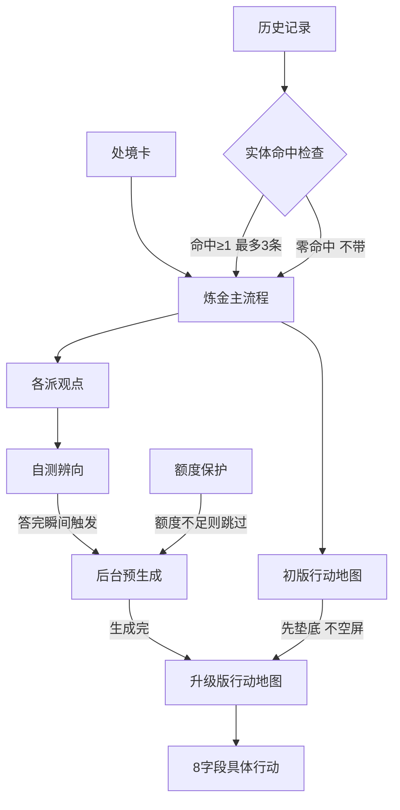

# 山外山 · 三项产品问题修复设计定论（2026-09-05）

> 来源：用户提的 3 个产品硬伤，经 grill-me 逐条深挖、用户逐条拍板。
> **状态：设计已定，尚未实现（产品代码一行未动）。**

## 一、代码现状（探查证实，非猜测）

| 问题 | 代码证据 |
|---|---|
| 历史是摆设 | `records` 只用于 Landing 列表 + 刘看山聊天 RAG；`/api/alchemy`（App.jsx:59-63、zhihu.js:458）签名里**没有 records**，每次分析独立 |
| 行动地图与测评脱节 | 初始 `data.actions` 在 quiz **之前**随炼金一起生成（zhihu.js:531-536、:626），内容不含 quizResult，只有排序用到 |
| 观点页不接处境卡 | ConflictWall 只收 `conflict`（App.jsx:310、ConflictWall.jsx:112），persona 靠后端烤进 `matchReason`（zhihu.js:598-601）才显得贴合 |

---

## 二、决策摘要

### 目标
让「处境卡 → 观点 → 测评 → 行动地图」真正咬合成一条线，让历史记录真正影响分析结果，让行动地图具体到照着做就能拿到结果。

### 架构总览

### 关键决策

**决策 A — 板块串联：后台预生成 + 无感升级 + 保留手动按钮 + 配额保护**

- 用户答完测评**最后一题的瞬间**，后台立刻偷偷调 `/api/actions` 生成"吸收辨向"的升级版。此时用户还在结果页/山头页，**无感、零等待**。
- 用户点进行动页：升级版已就绪（大概率）→ 直接展示；未就绪 → 先显示基于处境卡的**初版**（不空屏、不转圈），生成完自动替换。
- **防闪跳规则**：
  - 用户未滚动 → 无感替换，保留滚动位置，变化卡片轻微高亮 + toast「已结合你的自测结果更新」
  - 用户已滚动正在读 → **绝不替换**，顶部弹不遮挡的小条「更贴合你自测结果的行动地图已生成 → 查看」，点了才换
  - 用户手动点过「重做」→ 关闭自动替换，那份归用户
- **跳过测评**的用户：展示初版 + 温和提示「答完自测后更贴合」，不拦截、不跳转。
- **额度保护**：自动生成前查直答剩余额度，低于安全线则跳过、退回手动按钮。

**决策 B — 历史接入：新炼金参考历史**

- 每条历史压成一行：`9/1 炼「30岁转行数据分析」：最信「成功转行者」，已验证「JD硬要求对照」，盲区「谨慎派」未补`
- 以**独立区块**注入提示词，强约束「仅供参考，若与本次问题无关则完全忽略」；界面明示「本次参考了你 N 条历史」。
- **相关度判定 = 核心实体词命中法**（不是整句相似度）：
  - 从当前问题抽核心实体，历史命中 **≥1 个**即算相关，**最多带 3 条**，按命中数排序
  - 配小同义词表：转行 = 换赛道 = 跳槽 = 转型 = 转岗；找工作 = 求职 = 应聘
- **为什么不用整句相似度**（实测打脸）：整句 Jaccard 下相关项仅 28.6%，"换赛道"被算成 0%，而 35% 阈值会导致**一条都不带**（历史变回摆设）。改用实体命中后实测：

| 历史 | 命中实体 | 相关度 | 结论 |
|---|---|---|---|
| 转行数据分析需要学什么 | 转行、数据分析 | 67% | 带 |
| 30岁了该不该换赛道 | 转行、30岁 | 67% | 带（同义词生效） |
| 数据分析师前景怎么样 | 数据分析 | 33% | 带 |
| 做陶瓷能养活自己吗 | 无 | 0% | **不带 ✓** |
| AIGC行业找工作 | 无 | 0% | **不带 ✓** |

  → 当年「问陶瓷答 AIGC」的串味 bug，从根上被掐死。
- **历史三用途全要**：① 不重复——跳过已验证过的假设 ② 指出变化——「上次最信 A 派、这次最信 B 派」意味着什么 ③ 延续——接着上次没做完的往下走。

**决策 C — 行动地图：6 字段扩到 8 字段**

`when` / `hypothesis` / `where` / `steps` / `done` / `goSignal` / `stopSignal` / `role`

| 字段 | 含义 |
|---|---|
| `when` | 时间拆细：今天/本周/本月 分别做哪一步 |
| `hypothesis` | 要验证的关键判断 |
| `where` | 去哪儿做：具体平台 + 搜什么关键词 |
| `steps` | 怎么操作：一步步，**带明确数字** |
| `done` | 完成标准：做完交付什么、怎么算做成 |
| `goSignal` | 坚持信号 |
| `stopSignal` | 收手信号 |
| `role` | 该任务验证哪一派 |

**改造前后对比（同一条行动）**：

> 现在：🔍 转行数据分析是否可行 / 🎯 去了解行业对转行者的真实要求 / ✅ 要求可补齐 / 🛑 硬门槛跨不过
>
> 改完：⏱ 今天（2小时内） / 🔍 数据分析岗对"没经验的人"是不是真不收 / 📍 BOSS直聘·拉勾，搜"数据分析师"筛1-3年 / 🎯 ①找3个目标城市岗位 ②抄下硬性要求 ③逐条对照打勾 / ✓ 一张3行对照表 / 🟢 ≥2个岗只差1-2条可补→路通 / 🟢 全要2年经验且一条不沾→换相邻方向

UI 处理：**默认折叠「两把尺子」**，点开才看，避免 5 个信息块 × 4-6 张卡导致页面过长。

---

## 三、遗留风险

| 风险 | 说明与缓解 |
|---|---|
| **老历史兼容** | localStorage 已存的历史是 6 字段，新结构读取时缺失字段须给合理默认，**不能显示空白或崩溃** |
| **成本与耗时上升** | 8 字段输出更长，叠加 A 的自动重生，token 与耗时都上升；直答额度 100/天，自动触会使每用户 1→2 次调用，日服务量约 100→50（已有额度保护兜底） |
| **兜底模板须重写** | `fallbackActions` 现在的硬编码模板要升级成带平台+步骤+交付物，否则直答挂掉时又退回泛泛而谈 |
| **同义词表需人工维护** | 表很小；且**不维护的后果只是"漏带"，绝不会串味**——方向是安全的 |
| **ConflictWall 仍未接 persona** | 目前只靠后端 `matchReason`。若要彻底"咬合"，需把处境卡也传进观点页 |

---

## 四、下一步（实现时的改动清单）

1. **后端 `zhihu.js`**：`alchemy()` 签名加 `records`；新增历史压缩 + 实体命中筛选（复用 `topicKeywords`）；`normalizeActions` 扩到 8 字段；`fallbackActions` 全面重写；`generateActions` prompt 适配 8 字段。
2. **后端 `server.mjs`**：`/api/alchemy` 接收 records；`/api/actions` 加额度检查（额度保护）。
3. **前端 `App.jsx`**：测评答完瞬间触发后台预生成并存 state；把处境卡传进 ConflictWall。
4. **前端 `ActionMap.jsx`**：优先用预生成升级版 → 否则初版 → 监听完成无感替换；实现防闪跳三档规则；保留手动按钮；8 字段渲染 + 默认折叠两把尺子。
5. **前端 `ConflictWall.jsx`**：接收处境卡，展示与用户处境相关的部分。
6. **兼容**：6 字段老数据读取时的字段兜底。
7. **验证**：用「问陶瓷但历史里有 AIGC/数据分析」做串味回归测试，确认陶瓷结果里不出现 AIGC 词。

> 工作流提醒：改 `src/` 需 `npm run build`；改 `zhihu.js`/`server.mjs` 只需重启服务；实际在跑的是桌面副本（`C:\Users\张鸿飞\Desktop\看山_基于知乎生态的求职百科全书`）。
