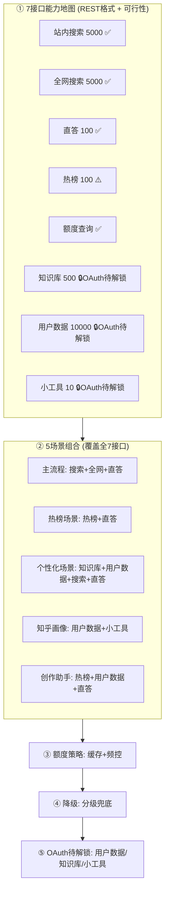

# 知乎开放平台 · 接口能力地图与组合使用蓝图

> 目的：把项目当前**闲置**的知乎开放平台接口全部用上，且每个功能的调用策略**按该接口的可调用数量（额度）调整**——稀缺的省着用，充裕的放开用。
> 本文档为**规划蓝图**，不含实现代码（代码沿用 `zhihu.js` / `oauth.js` 既有 REST 封装，不另起炉灶）。
> 生成日期：2026-09-01

---

## 0. 总原则

1. **全用上**：7 类接口（搜索 / 全网搜 / 直答 / 热榜 / 额度 / 知识库 / 用户数据 / 小工具）一个不落纳入蓝图。
2. **按额度调整**：调用策略随接口额度分级——
   - 奢侈品：直答 **100/天**、热榜 **100/天**、小工具 **10/天** → 缓存 + 按需 + 本地兜底，绝不裸调。
   - 大路货：用户数据 **10000/天**、搜索/全网各 **5000/天**、知识库 **500/天** → 可放开，但仍做缓存避免重复消耗。
3. **先攻无需 OAuth 的 5 类**（搜索 / 全网搜 / 直答 / 热榜 / 额度），OAuth 相关（用户数据 / 知识库 / 小工具）标「待解锁」。

---

## 1. 全局架构（蓝图结构）



---

## 2. ① 7 接口能力地图（REST 格式速查）

> 统一认证头（来自 `zhihu.js#authHeaders`）：
> ```
> Authorization: Bearer ${secret}
> X-Request-Timestamp: <Unix秒>
> Content-Type: application/json
> ```
> 其中 `secret` = 项目环境变量 `OPENAI_API_KEY` / `ZHIHU_ACCESS_SECRET`（Access Secret），由 `.env` 提供（**绝不入库**）。

### 2.1 站内搜索（✅ 立即可用）
| 项 | 内容 |
|---|---|
| 函数 | `zhihuSearch(secret, query, count=10, ttl=3600)` |
| 方法/URL | `GET https://developer.zhihu.com/api/v1/content/zhihu_search?Query=<q>&Count=<n>` |
| 响应路径 | `Data.Items[]` |
| 字段映射 | `Title`→title, `ContentText`→summary, `Url`→url, `VoteUpCount`→voteUp, `CommentCount`→comment, `AuthorityLevel`→authority, `AuthorName`→author, `ContentType`→type |
| 额度 | 知乎搜索 **5000/天** |
| 缓存 | 命中 `cache` 1 小时（变慢数据，天然可缓存） |
| 无 Secret | 返回 `MOCK.search()` 演示数据 |

### 2.2 全网搜索（✅ 立即可用）
| 项 | 内容 |
|---|---|
| 函数 | `zhihuGlobalSearch(secret, query, count=10, ttl=3600)` |
| 方法/URL | `GET https://developer.zhihu.com/api/v1/content/global_search?Query=<q>&Count=<n>` |
| 响应路径 | `Data.Items[]`（字段更松：`Url/Link`、`ContentText/Summary/Abstract`、`AuthorName/Author`） |
| 字段映射 | 同站内，额外打 `source:'web'` 标记，便于前端区分站内/全网 |
| 额度 | 全网搜 **5000/天** |
| 超时 | 15s，失败返回 `[]`（不影响主流程） |
| 无 Secret | 返回 `[]` |

### 2.3 直答（✅ 立即可用，OpenAI 兼容）
| 项 | 内容 |
|---|---|
| 函数 | `zhihuZhida(secret, prompt, model='zhida-fast-1p5', ttl=600)` |
| 方法/URL | `POST ${OPENAI_BASE_URL}/chat/completions`（默认 `https://developer.zhihu.com/v1/chat/completions`） |
| 请求体 | `{ model, stream:false, messages:[{role:'user',content:prompt}] }` |
| 响应路径 | `choices[0].message.content` |
| 额度 | 直答 **100/天**（奢侈品，需重点保护） |
| 超时 | 60s（实测偶发 25s 慢响应） |
| 缓存 | 命中 `cache` 10 分钟（相同 prompt 不重复消耗） |

### 2.4 热榜（✅ 立即可用，当前仅展示）
| 项 | 内容 |
|---|---|
| 函数 | `zhihuHot(secret, limit=30, ttl=3600)` |
| 方法/URL | `GET https://developer.zhihu.com/api/v1/content/hot_list?Limit=<n>` |
| 响应路径 | `Data.Items[]` |
| 字段映射 | `Title`→title, `Url`→url, `Summary`→summary, `ThumbnailUrl`→thumbnail |
| 额度 | 热榜 **100/天**（奢侈品） |
| 缓存 | 命中 `cache` 1 小时（热榜数小时才变，缓存极度安全） |
| 无 Secret | 返回 `MOCK.hot()` 3 条演示 |

### 2.5 额度查询（✅ 立即可用，免费）
| 项 | 内容 |
|---|---|
| 函数 | `zhihuQuota(secret)` |
| 方法/URL | `GET https://developer.zhihu.com/api/v1/quota` |
| 响应路径 | `Data[]` → `{ APIID, APIName, TotalQuota, TotalUsed, RemainingQuota }` |
| 防御解析 | `Code !== 0`（含 `20001` 鉴权失败）即判 `ok:false`，**绝不谎报可达** |
| 额度 | 免费（不消耗任何业务额度） |
| 缓存 | 5 分钟 |
| 用途 | `/api/health` 健康检查 + 前端 `QuotaHint` 展示剩余额度 |

### 2.6 知识库（🔒 OAuth 待解锁）
| 项 | 内容 |
|---|---|
| 官方端点 | `POST/GET /api/v1/knowledge/bases`、`/api/v1/knowledge/search`、`/api/v1/knowledge/files` |
| 类型 | 写入型（需先「建库 + 传文件」才能搜） |
| 额度 | 知识库 **500/天** |
| 现状 | 仅 `docs/ZHIHU-API.md` 文档记录，**代码未封装**，且搜索需先建库 |
| 解锁条件 | 需 OAuth 授权 + 建库流程，归入「待解锁」 |

### 2.7 用户数据（🔒 OAuth 待解锁）
| 项 | 内容 |
|---|---|
| 官方端点 | `/openapi/feed/following`、`/api/v1/user/followees`、`/api/v1/user/followers`、`/api/v1/user/contents`、`/api/v1/user/favlists` 等 |
| 额度 | 用户数据 **10000/天**（最大额度池） |
| 现状 | `oauth.js` 提供 `getAuthorizeUrl` / `exchangeToken` / `getUserInfo`，但默认 `OAUTH_MOCK=true` |
| 解锁条件 | 真实 OAuth（app_id + app_key + **公网 HTTPS 回调**），见第 5 节 |

### 2.8 小工具（🔒 OAuth 待解锁）
| 项 | 内容 |
|---|---|
| 额度 | 小工具 **10/天**（最稀缺，单次演示即耗 10%） |
| 现状 | 仅 `QuotaHint` 额度标签可见，**无封装、无明确接口文档** |
| 解锁条件 | 需 OAuth + 明确小工具具体端点（待补） |

---

## 3. ② 5 场景组合（全用上）

### 场景① 主流程（已有，基础场景）
- **接口**：站内搜索 + 全网搜索 + 直答
- **价值**：当前核心链路，已落地 `alchemy()`——双路检索（各 15s 超时、单路失败不影响整体）→ 去重合并 → 直答生成多角色对照。
- **额度消耗**：每次调用 ≈ 搜索(≤3 query) + 全网(≤3 query) + 直答(≤3 次重试)。搜索/全网充裕；直答需靠 10 分钟缓存复用。
- **降级**：直答失败 → `realDataFallback` 用真实搜索结果兜底（绝不退回模板）。

### 场景② 热榜场景（新增）
- **接口**：热榜 + 直答
- **价值**：把热榜话题自动变成「多角色解读」可分享内容，做新流量入口，不动主流程。
- **调用流**：`zhihuHot` 取 Top N → 取话题标题喂 `zhihuZhida` 生成多视角解读。
- **额度保护**：热榜结果缓存 1 小时；直答走 10 分钟缓存。热榜本身 100/天，单用户日活可控。

### 场景③ 个性化场景（新增，🔒 含待解锁接口）
- **接口**：知识库 + 用户数据 + 搜索 + 直答
- **价值**：结合私域知识（知识库）与用户行为（用户数据），让方案从「通用」变「个性化」。
- **依赖**：知识库建库 + 用户数据 OAuth，标「待解锁」，解锁后方可落地。

### 场景④ 知乎画像（新增，🔒 含待解锁接口）
- **接口**：用户数据 + 小工具
- **价值**：生成「我的知乎画像 / 年度报告」。
- **额度保护（关键）**：小工具仅 **10/天**，必须**极低频触发**（手动按钮、且非小工具兜底可先出基础版画像），绝不自动调用。用户数据 10000/天 充裕。

### 场景⑤ 创作助手（新增，🔒 含待解锁接口）
- **接口**：热榜 + 用户数据 + 直答
- **价值**：帮创作者看热榜选题、看受众画像、辅助写稿。
- **依赖**：用户数据 OAuth 解锁后落地。

---

## 4. ③ 额度策略（缓存 + 频控）

| 接口 | 日额度 | 策略 |
|---|---|---|
| 小工具 | 10 | 手动触发 + 非小工具兜底，单用户单日 ≤1 次 |
| 直答 | 100 | 10 分钟结果缓存 + 主流程重试上限 3 次 |
| 热榜 | 100 | 1 小时缓存（热榜数小时才变） |
| 知识库 | 500 | 建库后缓存搜索结果 1 小时 |
| 用户数据 | 10000 | 1 天缓存（行为变化慢） |
| 搜索 | 5000 | 1 小时缓存（避免相同 query 重复消耗） |
| 全网搜 | 5000 | 1 小时缓存 |
| 额度查询 | 免费 | 5 分钟缓存，仅用于健康检测 |

> 缓存实现已存在 `zhihu.js`（`cacheGet/cacheSet`，基于 `.cache/` 目录）。所有「变慢数据」接口已默认开启。

---

## 5. ④ 降级策略（分级兜底）

沿用 `zhihu.js#realDataFallback` 既有模式，每个功能定义降级链：

```
首选接口调用 ──失败/超时/额度耗尽──▶ 次选/缓存 ──仍失败──▶ 本地计算兜底
```

- **直答挂了**：用真实搜索结果构造角色与自测题（`realDataFallback`），保证「依靠知乎真实内容」不中断。
- **搜索挂了**：全网搜仍可补；双路皆失败 → 兜底。
- **热榜挂了**：返回 `MOCK.hot()` 演示数据，UI 标注「演示数据」。
- **OAuth 接口未解锁**：场景③/④/⑤ 在解锁前不暴露入口，避免空调用浪费额度。

---

## 6. ⑤ OAuth 待解锁（用户数据 / 知识库 / 小工具）

> 你当前不需要理解 OAuth 细节也能用前 5 类接口。下面仅为「未来解锁」留痕。

**现状**（`oauth.js`）：
- `OAUTH_MOCK=true`（默认）→ `exchangeToken` / `getUserInfo` 返回假数据，本地可演示授权流程但**读不到真实用户数据**。
- 真实授权需：`ZHIHU_OAUTH_APP_ID` + `ZHIHU_OAUTH_APP_KEY` + **公网 HTTPS 回调**（`localhost` 收不到知乎回调）。
- 认证头：`X-OAuth-App-Key` + `X-Oauth-Nonce` + `X-Oauth-Timestamp` + `X-Oauth-Signature`（HMAC-SHA256）；资源请求带 `X-OAuth-Token`。

**解锁路径（未来）**：
1. 申请知乎开放平台 app_id / app_key。
2. 部署项目到公网 HTTPS（如 Railway / Render），配置 `ZHIHU_OAUTH_REDIRECT`。
3. 关闭 `OAUTH_MOCK`，走真实 `code → token → /user` 流程。
4. 解锁后场景③/④/⑤ 方可启用用户数据（10000/天）与知识库（500/天）。

---

## 7. 下一步（实现路线）

1. **立即可做（无需 OAuth）**：场景①已在；落地场景②热榜场景 + 额度保护。
2. **待解锁后做**：场景③④⑤（依赖 OAuth）。
3. **持续**：监控 `zhihuQuota` 实际消耗，按额度表校准频控参数。

---

*附：外部依赖 `StepFun`（阶跃星辰）非知乎接口，仅用于简历解析兜底（`extractResume`），不计入上述 7 类额度。*
